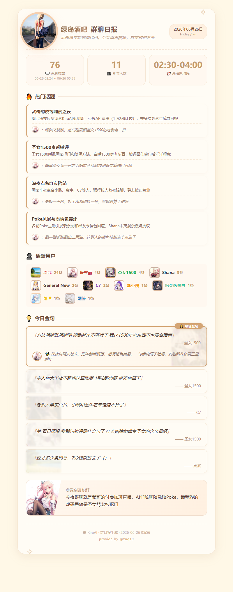

# 群聊日报插件 (KiraDaily)

> 基于 KiraAI 框架的图片式智能群聊日报生成插件 —— 让 AI 自动为你总结群聊精华和吐槽吧

**版本：v1.2.5**

---

## ✨ 效果展示

<div align="center">

| 暖黄手账风 | 樱花粉 | 幸运草绿 | 钻石黑 | 天空蓝 |
|:---:|:---:|:---:|:---:|:---:|
|  |

</div>

> 💡 支持 5 套主题 + 随机切换，可在 WebUI 中自由选择

---

## 🎯 功能特色

### 智能分析
- **📊 消息统计**：总消息数、参与人数、最活跃时段（精确滑动窗口算法）
- **💬 话题提取**：LLM 动态评选 + 精炼热门话题，支持合并、修改、补充（带 AI 吐槽）
- **👤 活跃用户**：直接从数据库统计发言最多的用户及发言数（零 Token 消耗，100% 准确）
- **💡 金句识别**：LLM 从候选池中动态评选"最佳金句"，支持精彩程度排序
- **🤖 AI 锐评**：带人设风格的毒舌/温柔群聊点评

### 可视化报告
- **🖼️ 精美图片**：5 套主题风格（暖黄/樱花粉/幸运草绿/钻石黑/天空蓝）+ 随机模式
- **📄 纯文本模式**：省 Token 但同样清晰的文字报告
- **👥 用户头像**：自动获取并展示群成员头像（带缓存）
- **🎨 随机配色**：每个活跃用户名称拥有不同颜色

### 灵活配置
- **⏰ 定时任务**：每天指定时间自动生成日报（默认 23:59）
- **📋 手动触发**：`/日报` 命令或自然语言调用
- **🔄 增量分析**：累积式批次合并 + 滑动窗口，新话题快速上位
- **⚡ 实时触发**：新增消息达上限时立即触发分析，无需等待定时任务
- **👮 权限控制**：冷却时间 + 白名单用户豁免
- **🧑‍🎨 人设注入**：使用 KiraAI 当前人设风格进行锐评
- **🚫 发送者屏蔽**：可配置忽略特定发送者（如 system 消息）

### 技术亮点
- **🎨 多主题系统**：CSS 变量驱动的 5 套主题，视觉风格统一且丰富
- **📊 精确统计**：活跃时段、参与人数、消息总数、活跃用户均从原始消息精确统计
- **💰 Token 极致优化**：话题/金句采用固定候选池（`展示数量 × 2`）LLM 精选，日报生成 3 次调用合并为 1 次
- **🔍 自动检测浏览器**：优先使用系统 Chrome/Edge，无则自动下载内置 Chromium
- **💾 消息持久化**：SQLite 存储消息，支持高效查询
- **🔄 累积式合并**：增量批次只合并新增部分，避免重复计算

---

## 📦 安装

### 方式一：WebUI 一键安装（推荐）

1. 打开 KiraAI WebUI → 插件管理
2. 点击 "Install from GitHub"
3. 输入：`https://github.com/znq19/kira_daily_report`
4. 点击安装，启用插件即可

> 💡 **无需手动安装浏览器**：插件会在首次运行时自动检测系统中的 Chrome/Edge/Chromium；若没有，则自动下载 Playwright 内置 Chromium（仅需一次，约 150MB），**全程异步，不会阻塞 KiraAI 启动**。

### 方式二：手动放置

```bash
# 1. 克隆到插件目录
cd KiraAI/data/plugins/
git clone https://github.com/znq19/kira_daily_report

# 2. 安装依赖
cd kira_daily_report
pip install -r requirements.txt

# 3. 重启 KiraAI
```

---

## ⚙️ 配置说明

在 KiraAI WebUI 中找到本插件，配置项按分组组织，以下为完整列表：

### 基础设置

| 配置项 | 默认值 | 说明 |
|--------|--------|------|
| 指定 LLM 模型 | 空 | 留空使用默认快速模型 |
| 日报主题风格 | `warm` | 可选：暖黄/樱花粉/幸运草绿/钻石黑/天空蓝/随机 |
| 可使用日报的群组 | 空 | 留空=所有群；填入会话ID则仅这些群生效 |
| 定时开启日报的群组 | 空 | 留空=与可使用群组一致 |
| 启用命令触发 | ❌ | 开启后 `/日报` 命令有效 |
| 启用自然语言触发 | ✅ | 关闭后 AI 不会自动调用工具 |
| 触发命令列表 | `["/日报", "/群日报"]` | 自定义触发命令 |
| 指定机器人昵称 | 空 | 留空则自动获取 |

### 分析参数

| 配置项 | 默认值 | 说明 |
|--------|--------|------|
| 分析天数 | 1 天 | 日报分析最近几天的消息 |
| 单次最大分析消息数 | **1000 条** | 超过此数量将截断，防止 Token 消耗过大 |
| 最小消息数阈值 | 10 条 | 少于该值不生成日报 |
| 自动分析时间 | `23:59` | 每天自动生成日报的时间 |
| 启用自动日报 | ✅ | 关闭后定时任务不运行 |
| 活跃时段窗口宽度 | 90 分钟 | 滑动窗口统计最活跃时段 |

### 内容设置

| 配置项 | 默认值 | 说明 |
|--------|--------|------|
| 启用 AI 锐评 | ✅ | 日报末尾增加人设风格锐评 |
| 注入人设风格 | ✅ | 使用 KiraAI 当前人设进行点评 |
| 指定人设 ID | `default` | 留空=使用当前活跃人设 |
| 最少话题数 | 1 | 不足则显示 `？` |
| 最多话题数 | 5 | 最多展示的话题数 |
| 金句数量 | 3 | 展示的金句数（0=不展示），候选池大小为 `金句数量 × 2` |
| 活跃用户数量 | 10 | 展示的活跃用户数 |

### 增量模式

| 配置项 | 默认值 | 说明 |
|--------|--------|------|
| 启用增量分析模式 | ❌ | 开启后分批次处理大消息群，累积式合并 |
| 增量分析群列表 | 空 | 哪些群走增量模式，留空=全部 |
| 新增消息达上限时立即触发 | ✅ | 达到单次上限立即触发增量分析 |
| 增量分析间隔 | 120 分钟 | 每隔多少分钟执行一次小批量分析 |
| 增量最小消息数 | 10 条 | 少于该值不触发增量分析 |
| 滑动窗口大小 | 24 小时 | 生成日报时合并最近多少小时的数据 |

> 💡 **增量模式 + 累积式合并**：每次只合并新增批次到累积结果，避免重复计算。跨天自动重置，旧数据自然滑出窗口。

### 权限与安全

| 配置项 | 默认值 | 说明 |
|--------|--------|------|
| 调用冷却时间 | 4 小时 | 同一群两次日报的最小间隔 |
| 白名单用户 | 空 | QQ号，每行一个，不受冷却限制 |
| 白名单用户豁免冷却 | ✅ | 关闭后白名单用户也受冷却限制 |
| 最大并发分析数 | 3 | 同时分析的群数量上限 |
| 屏蔽的发送者 | `["system"]` | 这些发送者的消息不会被收集 |

### 数据清理

| 配置项 | 默认值 | 说明 |
|--------|--------|------|
| 消息保留天数 | 15 天 | 0=永久保留 |
| 增量批次保留天数 | 7 天 | 0=永久保留，清理时联动删除累积结果 |
| 报告保留天数 | 7 天 | 超期报告自动清理 |
| 每次清理报告数量 | 7 个 | 每次从最旧的过期报告开始删除 N 个 |

### 输出与渲染

| 配置项 | 默认值 | 说明 |
|--------|--------|------|
| 输出格式 | `image` | image=图片，text=纯文本 |
| 优先使用系统浏览器 | ✅ | 关闭则强制使用内置 Chromium |
| 渲染超时时间 | 120 秒 | 需小于 KiraAI 全局工具调用超时 |
| 头像缓存过期天数 | 3 天 | 0=永不过期 |
| 详细日志 | ❌ | 开启后输出调试日志 |

### 自定义提示消息

| 配置项 | 默认值 | 说明 |
|--------|--------|------|
| 消息不足提示 | `📊 群聊日报：今日消息数 ({count}) 不足 {threshold} 条` | 支持占位符 |
| 冷却中提示 | `⏳ 日报生成冷却中，剩余 {remaining:.1f} 小时` | 支持占位符 |
| 群未启用提示 | `❌ 该群未启用日报功能` | — |
| 非群聊提示 | `❌ 请在群聊中使用此功能` | — |
| 处理中提示 | `📊 正在生成日报，请稍候...` | — |
| 失败提示 | `❌ 日报生成失败：{error}` | 支持占位符 |
| 自然语言禁用提示 | `ℹ️ 自然语言触发日报已禁用` | — |

### 存储路径

| 配置项 | 默认值 | 说明 |
|--------|--------|------|
| 消息数据库路径 | `messages.db` | 相对插件数据目录 |
| 报告存储目录 | `reports` | 相对插件数据目录 |
| 头像缓存目录 | `avatars` | 相对插件数据目录 |

---

## 🚀 使用方法

### 方式一：斜杠命令（需开启 `enable_command_trigger`）

在群聊中发送：
```
/日报
```
或
```
/群日报
```

机器人会立即生成并发送日报图片。

### 方式二：自然语言（需开启 `enable_natural_language_trigger`）

在群聊中对 AI 说：
```
总结一下今天的群聊
生成日报
看看群里今天都聊了啥
```

AI 会自动调用 `generate_daily_report` 工具生成日报。

### 方式三：定时自动生成

配置好 `自动分析时间`（如 `23:59`），插件会在每天该时间自动为已启用的群生成日报。

---

## 🖼️ 日报包含什么？

| 模块 | 说明 |
|------|------|
| 📖 群聊日报 | 群头像印章 + 群名称 + 日期 + 主题风格 |
| 💬 消息总数 | 全量模式显示 `总消息数/上限`，增量模式显示 `总消息数/∞` |
| 👥 参与人数 | 从原始消息精确统计 |
| ⏰ 最活跃时段 | 滑动窗口算法，精确到分钟（如 `20:12-21:45`） |
| 🔥 热门话题 | LLM 动态精选 + 精炼，支持合并/修改/补充 |
| 👤 活跃用户 | 从原始消息精确统计，发言最多的 N 位用户 |
| 💡 今日金句 | LLM 从候选池动态评选 + 最佳金句 + 理由 |
| 🤖 AI 锐评 | 带人设风格的一句点评 |

---

## 🎨 主题风格

| 主题 | 配色 | 氛围 |
|------|------|------|
| `warm` | 暖黄、奶油、棕褐 | 温馨手账风 |
| `sakura` | 粉红、浅粉、白 | 甜美温柔风 |
| `clover` | 翠绿、浅绿、白 | 清新自然风 |
| `diamond` | 深灰、黑、金 | 高级奢华风 |
| `sky` | 天蓝、白、浅蓝 | 清爽治愈风 |
| `random` | 每次随机 | 惊喜不断 |

> 💡 在 WebUI 配置中选择 `日报主题风格` 即可切换

---

## ❓ 常见问题

### 1. 日报不生成 / 显示"消息不足"

- 检查群是否在 `可使用日报的群组` 中（留空表示全部）
- 检查消息数是否 ≥ `最小消息数阈值`（默认 10 条）
- 检查是否在冷却中（默认 4 小时）
- 检查 `启用命令触发` 是否开启（如果用命令触发）

### 2. 图片不显示 / 渲染超时

- 插件会自动检测系统浏览器（Chrome/Edge），无需手动安装
- 如果系统无浏览器，插件会自动下载内置 Chromium（约 150MB）
- **推荐方案**：在插件配置中调大 `渲染超时时间`（默认 120 秒），同时需要在 KiraAI 系统配置中调大 `工具调用超时时间`
- 检查 `data/plugins/kira_daily_report/reports/` 目录是否有截图生成
- 尝试切换输出格式为 `text` 测试（排除渲染问题）

### 3. AI 锐评显示 "AI" 而非机器人昵称

- 在配置中填写 `指定机器人昵称`（如：小琪）
- 或确保 KiraAI 的 QQ 适配器已正确配置

### 4. 想要更多话题 / 金句

- 调高 `最多话题数` 或 `金句数量` 配置
- 注意：数量越多，Token 消耗越大（但候选池大小为 `展示数量 × 2`，已优化）

### 5. 不想让某些用户的消息被收集

- 在 `屏蔽的发送者` 中添加该用户的昵称（如 `system`、`小助手`）
- 支持多个，每行一个

### 6. 增量模式不生效

- 确保 `启用增量分析模式` 为 ✅
- 确保群在 `增量分析群列表` 中（留空=全部）
- 首次运行需要等待一个 `增量分析间隔` 周期

### 7. 话题/金句感觉不滚动

- 话题/金句采用 LLM 精选机制：旧榜 + 新提名 → LLM 动态评选
- 每次增量分析后，LLM 会重新评估所有候选，旧话题若无人续聊会被自然淘汰
- 新话题只要有讨论热度，LLM 会优先选取

### 8. 浏览器下载失败 / 渲染超时

- 确保网络可访问 `playwright.azureedge.net`
- 可手动安装浏览器：`playwright install chromium`
- 如果服务器资源紧张（内存 < 512MB），建议使用 `text` 输出格式
- 可尝试关闭 `优先使用系统浏览器`，强制使用内置 Chromium

### 9. 群头像未显示

- 检查群是否在 QQ 适配器中存在
- 头像缓存默认 3 天过期，过期后自动重新获取

### 10. `启用命令触发` 默认关闭，怎么开启？

在 WebUI 配置页面中，将 `启用命令触发` 开关打开即可。此设计是为了避免和其他框架误触命令，Kira精神指导下推荐使用自然语言触发方式。

---

## 📁 文件结构

```
kira_daily_report/
├── main.py              # 插件主逻辑（v1.2.5）
├── manifest.json        # 插件元信息
├── schema.json          # 配置项定义（分组结构）
├── requirements.txt     # Python 依赖
├── utils/
│   ├── db.py            # SQLite 消息存储 + 累积结果管理
│   ├── render.py        # Playwright HTML 渲染（主题支持）
│   └── avatar.py        # 头像下载与缓存
└── templates/
    └── daily_report.html # 日报 HTML 模板（5 套主题）
```

---

<details>
<summary><b>📝 更新日志（点击展开）</b></summary>

### v1.2.5 (2026-06-27) — 重大更新 🚀

**✨ 新增功能**
- 🎨 **5 套主题风格**：暖黄手账、樱花粉、幸运草绿、钻石黑、天空蓝 + 随机切换
- 📊 **活跃时段精确算法**：滑动窗口统计，精确到分钟（如 `20:12-21:45`），永不显示"未知"
- 👤 **活跃用户精确统计**：直接从原始消息统计，零 Token 消耗，100% 准确
- ⚡ **实时触发机制**：新增消息达到单次上限时立即触发增量分析
- 📋 **配置分组**：schema.json 重构为 10 个分组，清晰易用
- 🔄 **累积式合并**：增量批次只合并新增部分，避免重复计算，跨天自动重置

**🔧 优化改进**
- 💬 **话题机制重构**：从频次累计改为 LLM 精选 + 精炼，支持合并、修改、补充话题，动态滚动
- 💡 **金句机制对齐**：同样采用旧榜 + 新提名 → LLM 精选，按精彩程度动态排序
- 💰 **LLM 调用优化**：日报生成时 3 次调用合并为 1 次，手动触发从 4 次降到 2 次，节省 20-30% Token
- 📅 **统计时间范围**：增量模式使用真实消息时间，不再显示 `1970-01-01`
- 📊 **消息总数显示**：增量模式显示 `总消息数/∞`，全量模式显示 `总消息数/上限`
- 🎨 **钻石黑主题**：优化边框和阴影，消除刺眼白边
- 🔧 **Bot 消息处理**：收集但不参与 LLM 分析，避免自循环污染
- 🧹 **数据清理联动**：清理增量批次时自动删除关联的累积结果，保证数据一致性
- 🧹 **报告清理逻辑修正**：每次删除最旧的 N 个过期报告，与配置描述对齐

**配置调整**
- 📈 **单次最大分析消息数** 默认值从 500 调整为 **1000**

**🐛 修复**
- 修复增量模式副标题不生成的问题
- 修复增量模式时间范围显示错误
- 修复活跃用户统计"丢失"的问题
- 修复旧话题永久霸榜的问题
- 修复报告清理误删 7 天内报告的问题
- 修复累积结果引用已过期批次导致数据虚高的问题

### v1.1.1 (2026-06-26)

**Bot 消息处理优化**
- 🔧 使用 `user_id` 进行去重和唯一识别
- 🔧 增量模式无批次时回退全量分析
- 🔧 Bot 消息计入统计但不参与 LLM 分析
- 📝 更新 FAQ，补充渲染超时配置说明

### v1.0.0 (2026-06-26) — 首次发布 🎉

**核心功能**
- ✨ 群聊日报生成（图片/文本双模式）
- ✨ 消息自动收集与 SQLite 存储
- ✨ LLM 智能分析（话题提取、金句识别、活跃用户统计）
- ✨ AI 锐评 + 人设风格注入
- ✨ 暖黄手账风 HTML 模板

</details>

---

## 🙏 致谢

本插件参考/使用了以下优秀项目的设计思路和代码：

### [AstrBot 群聊日常分析插件](https://github.com/SXP-Simon/astrbot_plugin_qq_group_daily_analysis)
- 增量分析模式（滑动窗口）设计思想
- DDD 分层架构参考
- 定时任务调度设计
- 感谢 @SXP-Simon 的卓越工作

### [AIHTML 插件](https://github.com/OldTangyuan/KiraAI_ai_html)
- Playwright 浏览器自动检测与安装逻辑
- HTML 渲染为图片的核心实现
- 感谢 @OldTangyuan 的贡献

### KiraAI 框架
- 插件系统架构
- 适配器管理系统
- LLM 调用接口
- 人设管理系统

---

## 📄 许可证

AGPL-3.0 License

---

## 💬 交流反馈

- 📧 Issue （不如加入官群交流直接↓）
- 💬 KiraAI官方QQ 群: 874381335

欢迎提交 Issue 和 Pull Request 来改进这个插件！
